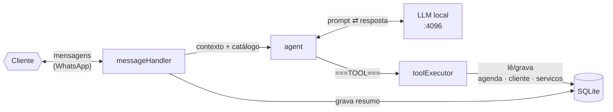
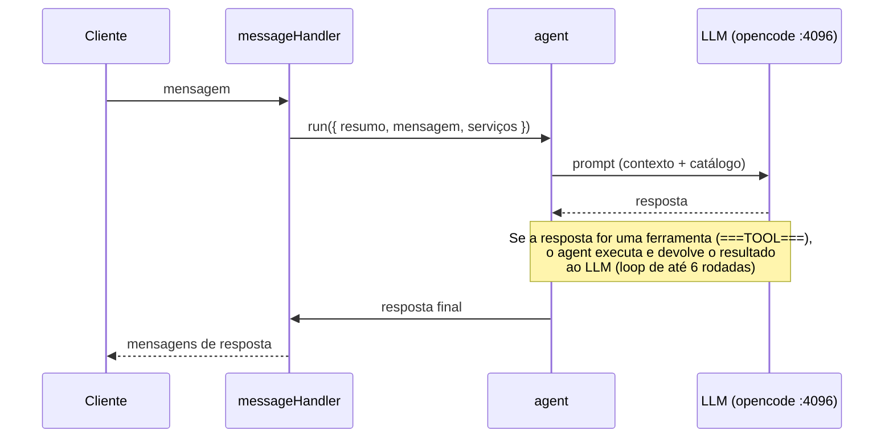

<div align="center">

# 🤖 WhatsApp AI Agent — Igor Dev

**Assistente virtual 24/7 para WhatsApp** — um **agente de IA** que atende os clientes do Igor, apresenta os serviços dele, agenda reuniões respeitando os horários de trabalho e lembra de cada cliente entre conversas. O "cérebro" é o **próprio opencode rodando localmente** (`opencode serve`) — sem API keys para começar.

[](https://nodejs.org)
[](#)
[](#)
[](#)
[](#)

> **📚 Documentação completa** — cada funcionalidade tem **página dedicada**: [`docs/FEATURES.md`](docs/FEATURES.md)

</div>

## 📑 Sumário

- [🚀 O agente (núcleo)](#nucleo)
- [🧩 Funcionalidades complementares](#features)
- [🏗️ Arquitetura](#arquitetura)
- [⚙️ Como rodar](#como-rodar)
- [🗄️ Banco de Dados](#banco-de-dados)
- [🔧 Configuração (.env)](#configuracao)
- [🧰 Comandos](#comandos)
- [🛠️ Dependências](#dependencias)
- [📚 Documentação](#documentacao)
- [🔒 Aviso de privacidade](#privacidade)

---

## <a id="nucleo"></a> 🚀 O agente (núcleo)

O coração do projeto: um atendente virtual que conversa de verdade com os clientes pelo WhatsApp.

- **Atendimento 24/7** via Baileys, com reconexão automática.
- **Catálogo de serviços** como fonte da verdade (tabela `servicos`): o LLM apresenta **apenas** o que está cadastrado (nome + descrição).
- **Valores? Nunca.** O bot **não informa preços** ao cliente — orçamento é passado pessoalmente pelo Igor (*detalhe em [agente-ia.md](docs/features/agente-ia.md)*).
- **Contexto por cliente:** resumo persistido + sessão viva no opencode (uma sessão por cliente).
- **Ferramentas via protocolo `===TOOL===…===END===`:** o modelo chama funções de negócio executadas localmente.
- **Mensagens múltiplas:** respostas divididas em até 3 mensagens (`|||`, 1,5s) + **boas-vindas** para cliente novo/inativo.
- **Edge cases cobertos:** mídia pede texto, banco offline tem resposta genérica, agenda cheia tem resposta amigável.

> [!TIP]
> Quer entender o núcleo a fundo (loop de raciocínio, protocolo de ferramentas, guardrails, backend alternativo)? Veja **[docs/features/agente-ia.md](docs/features/agente-ia.md)**.

## <a id="features"></a> 🧩 Funcionalidades complementares

Implementadas **em cima do núcleo**, cada uma com página própria:

| Feature | O que faz | Página dedicada |
|---------|-----------|-----------------|
| 📅 **Agendamento inteligente** | Agenda reuniões fora dos horários de trabalho; slots gerados sozinhos | [agendamento.md](docs/features/agendamento.md) |
| 🧠 **Memória de longo prazo** | Lembra de cada cliente entre conversas (resumo em SQLite) | [memoria.md](docs/features/memoria.md) |
| 🔔 **Notificações** | Avisa o Igor de agendamentos (WhatsApp + email) e emergências | [notificacoes.md](docs/features/notificacoes.md) |
| 🖼️ **Imagens / GIFs** | Envia logo, catálogo visual e GIF de boas-vindas via `manifest.json` | [imagens.md](docs/features/imagens.md) |
| 🛠️ **Painel admin (CRUD)** | Página web + API REST para gerenciar os serviços sem SQL | [painel-admin.md](docs/features/painel-admin.md) |
| 💬 **Chat Web** | Página de chat para conversar com o **mesmo agente** no navegador | [chat-web.md](docs/features/chat-web.md) |
| 🛡️ **Controle de gargalos & bloqueio** | Semáforo/limites de LLM, timeout, envio espaçado, fila de avisos à prova de travamento e bloqueio de clientes abusivos | [backpressure.md](docs/features/backpressure.md) |

> [!NOTE]
> Índice completo com núcleo **e** features: **[docs/FEATURES.md](docs/FEATURES.md)**.

---

## <a id="arquitetura"></a> 🏗️ Arquitetura



### Legenda

| Elemento | O que é | Papel no fluxo |
|---|---|---|
| **Cliente** | A pessoa que conversa com o Igor pelo WhatsApp | Envia mensagens e recebe as respostas do bot |
| **messageHandler** (`src/whatsapp/messageHandler.js`) | Orquestrador de cada mensagem | Resolve o telefone, trata mídia/boas-vindas, injeta contexto e envia a resposta final |
| **agent** (`src/llm/agent.js`) | Loop de raciocínio que conversa com o LLM | Monta o prompt e executa ferramentas quando o LLM pede |
| **LLM local** (`opencode serve :4096`) | O "cérebro": modelo de IA rodando no opencode | Gera as respostas do bot |
| **toolExecutor** (`src/services/toolExecutor.js`) | Executor de funções de negócio | Agenda, consulta disponibilidade, salva resumo, notifica emergência, envia imagem |
| **SQLite** (`data/agent.db`) | Banco de dados local | Clientees, agenda e catálogo de serviços |

Fluxo de cada mensagem, em detalhe:



### Por que o protocolo de ferramentas é via texto?

O `opencode serve` expõe a session API (`POST /session/:id/message`), **sem** `tools` nativos. A solução: o prompt instrui o modelo a responder com um envelope JSON marcado (`===TOOL===` / `===END===`); o `agent.js` executa a ferramenta no próprio processo e realimenta a mesma sessão com o resultado. Cada cliente tem **uma sessão** no opencode e **um registro** na tabela `clientes`.

### Nota sobre o transporte do WhatsApp

O envio/recebimento usa a lib **Baileys** diretamente (socket próprio, sessão em `.sessions/`). É funcional e auto-contido, mas **não é exatamente o padrão de mercado** — boa parte das integrações brasileiras usa a **Evolution API** (o mesmo Baileys por trás de uma API REST + webhooks).

> [!WARNING]
> **Evolução futura:** a doc pode passar a referenciar a **Evolution API** como camada de WhatsApp — [doc de referência](https://doc.evolution-api.com/). Para rodar/evoluir o projeto, você também pode **pedir auxílio ao próprio opencode** (a IA deste projeto), que conhece o código e as melhores práticas de deploy.

---

## <a id="como-rodar"></a> ⚙️ Como rodar

O projeto precisa de **2 processos rodando ao mesmo tempo** (IA + bot), em **2 terminais** (terminais 3 e 4 são opcionais: painel admin e chat web).

| Passo | O quê | Comando |
|---|---|---|
| **0** · 1ª vez | Instalar a CLI do opencode | `npm install -g opencode-ai` → `opencode --version` |
| **1** | Instalar dependências do projeto | `npm install` |
| **2** | Criar o `.env` | `copy .env.example .env` (Windows) · `cp .env.example .env` (Linux/Mac) |

> [!TIP]
> Depois de criar o `.env`, edite o que quiser (`NOTIF_*`, `ADMIN_TOKEN`…). Os padrões já funcionam para testes.

**3 · Terminal A — subir a IA local (deixe este terminal aberto):**

```bash
npm run serve            # opencode serve na porta 4096
```

Com senha (recomendado em rede compartilhada):

```bash
OPENCODE_SERVER_PASSWORD=uma-senha npm run serve
# e coloque o MESMO valor em OPENCODE_SERVER_PASSWORD no .env
```

**4 · Smoke test (opcional) — conferir a IA:**

```bash
npm run test:llm
```

**5 · Terminal B — iniciar o bot do WhatsApp:**

```bash
npm start
```

- Na **primeira vez**, um QR Code aparece no terminal: escaneie com o WhatsApp do Igor (WhatsApp → Ajustes → Aparelhos conectados → Conectar aparelho).
- Depois, a sessão fica salva em `.sessions` e **não precisa escanear de novo**.
- O bot gera e limpa a agenda sozinho (start + a cada 12h) — não precisa rodar `npm run seed`.

**6 · (Opcional) Terminal C — painel admin:**

```bash
npm run admin   # abra http://127.0.0.1:3000
```

> [!TIP]
> Alterações no painel valem **imediatamente**, sem reiniciar o bot.

**7 · (Opcional) Terminal D — chat web (portfólio):**

```bash
npm run web     # abra http://127.0.0.1:4000
```

Mesmo agente do WhatsApp, em uma página de chat no navegador — sem boas-vindas, só a conversa. (ver [chat-web.md](docs/features/chat-web.md))

### Como saber se está tudo de pé

| Log do bot | Significado |
|---|---|
| `[whatsapp] Conectado e pronto para atender 24/7.` | WhatsApp conectado ✅ |
| `[llm] opencode server OK (v1.x)` | IA no ar e respondendo ✅ |
| `[seed] N horários livres gerados/atualizados.` | Agenda preenchida ✅ |

> [!NOTE]
> Se a IA cair, o bot continua no WhatsApp mas responde "não consegui responder 😅". Basta subir o `npm run serve` de novo — sem reiniciar o bot.

---

## <a id="banco-de-dados"></a> 🗄️ Banco de Dados

SQLite via `better-sqlite3` (zero infra), caminho padrão `./data/agent.db`. Schema em `src/db/schema.js`.

- **`clientes`** — telefone (pk), nome, resumo (memória de longo prazo), timestamps.
- **`agenda`** — slots com `status`: `livre` → `agendado` → `confirmada`/`cancelada`. Slots livres passados são limpos automaticamente.
- **`servicos`** — catálogo editável (nome, descricao, **categoria**, ativo, ordem). O catálogo é apresentado ao bot **organizado por categoria** (ex: Design Gráfico, Engenharia, Montagem e Hardware…). O campo `preco` (se existir) **não** é lido nem repassado — valores só saem com o Igor. Edite sem SQL via `npm run admin`.
- **`avisos_pendentes`** — fila de notificações de processos sem WhatsApp (web/painel) → entregues pelo bot (ver [backpressure](docs/features/backpressure.md)).

---

## <a id="configuracao"></a> 🔧 Configuração (.env)

Veja o [`.env.example`](.env.example) completo. Principais variáveis:

| Variável | Padrão | Descrição |
|---|---|---|
| `LLM_BACKEND` | `local-opencode` | Backend da IA. |
| `OPENCODE_SERVER_URL` | `http://127.0.0.1:4096` | Onde o `opencode serve` está rodando. |
| `OPENCODE_MODEL` | default da máquina | Ex: `opencode/big-pickle`. |
| `WORK_SCHEDULE` | `1-4:12-21,5:10-19,6:8-14` | Horários de **trabalho/bloqueados**: `dias:inicio-fim`. |
| `SCHEDULE_START` / `SCHEDULE_END` | `7` / `24` | Janela do dia em que slots podem existir. |
| `SLOT_MINUTES` | `60` | Duração de cada slot (1h). |
| `HORIZON_DAYS` | `14` | Dias à frente do auto-seed. |
| `NOTIF_WHATSAPP` | vazio | Número do Igor p/ avisar agendamentos via WhatsApp. |
| `NOTIF_EMAIL` | vazio | Email do Igor p/ avisar agendamentos. |
| `SMTP_HOST`/`SMTP_PORT`/`SMTP_USER`/`SMTP_PASS` | Gmail | SMTP (senha de app). |
| `EMERGENCY_NUMBER` | vazio | Número que recebe alertas de urgência. |
| `IMAGENS_ATIVO` | `false` | Habilita envio de imagens/GIFs ao cliente. |
| `WELCOME_IMAGE` / `WELCOME_TEXT` / `WELCOME_INACTIVE_HORAS` | `boasvindas_gif` / texto / `24` | Boas-vindas. |
| `KEEP_MESSAGES` / `SUMMARIZE_EVERY` | `12` / `5` | Histórico volátil e frequência do resumo persistente. |
| `ADMIN_PORT` / `ADMIN_TOKEN` | `3000` / vazio | Porta e token do painel admin. |
| `WEB_HOST` / `WEB_PORT` | `127.0.0.1` / `4000` | Onde fica o chat web (página + API). |
| `LLM_MAX_CONCURRENT` / `LLM_TIMEOUT_MS` | `3` / `60000` | Turnos de IA em paralelo e teto por turno. |
| `ENVIO_MIN_GAP_MS` | `700` | Intervalo mínimo entre envios no WhatsApp (ms). |
| `WEB_MAX_CONCURRENT` / `WEB_TIMEOUT_MS` | `3` / `60000` | Teto de respostas simultâneas e protocolo de timeout no chat web. |

---

## <a id="comandos"></a> 🧰 Comandos

| Comando | Ação |
|---|---|
| `npm run serve` | Sobe o opencode server (:4096) — outra janela |
| `npm start` | Inicia o bot do WhatsApp |
| `npm run dev` | Inicia com watch |
| `npm run admin` | Painel web (CRUD de serviços) em http://127.0.0.1:3000 |
| `npm run web` | Chat web em http://127.0.0.1:4000 |
| `npm run seed` | Gera horários livres na agenda (manual — o bot já auto-seeda) |
| `npm run test:llm` | Smoke test da IA local |

---

## <a id="dependencias"></a> 🛠️ Dependências

**5 dependências diretas** (transitivas ficam sob responsabilidade do `npm`):

| Pacote | Para quê | Documentação |
|---|---|---|
| [`@whiskeysockets/baileys`](https://github.com/WhiskeySockets/Baileys) | Conexão com o WhatsApp (socket, sessão) | [GitHub + Wiki](https://github.com/WhiskeySockets/Baileys/wiki) · [Getting Started](https://github.com/WhiskeySockets/Baileys/wiki/Getting-Started) |
| [`better-sqlite3`](https://github.com/WiseLibs/better-sqlite3) | Banco de dados local (SQLite) | [GitHub](https://github.com/WiseLibs/better-sqlite3) · [API completa](https://github.com/WiseLibs/better-sqlite3/blob/master/docs/api.md) |
| [`dotenv`](https://github.com/motdotla/dotenv) | Variáveis de ambiente do `.env` | [GitHub + usage](https://github.com/motdotla/dotenv?tab=readme-ov-file#usage) |
| [`nodemailer`](https://nodemailer.com/) | Emails de notificação ao Igor | [**nodemailer.com**](https://nodemailer.com/) · [API](https://nodemailer.com/message/) |
| [`qrcode-terminal`](https://github.com/gtanner/qrcode-terminal) | QR Code de login no terminal | [GitHub](https://github.com/gtanner/qrcode-terminal) |

**Dependência global (fora do projeto):**

| Pacote | Instalação | Para quê | Documentação |
|---|---|---|---|
| [`opencode`](https://opencode.ai) | `npm install -g opencode-ai` | CLI de IA — roda o servidor local (`:4096`) que é o cérebro do bot | [**opencode.ai/docs**](https://opencode.ai/docs) · [npm](https://www.npmjs.com/package/opencode-ai) |

> [!NOTE]
> Em uma máquina limpa, basta `npm install` (diretas + transitivas) e `npm install -g opencode-ai`. Nenhuma API paga é necessária.

---

## <a id="documentacao"></a> 📚 Documentação

| Documento | Conteúdo |
|---|---|
| 📇 [`docs/FEATURES.md`](docs/FEATURES.md) | Índice de **todas** as funcionalidades (núcleo + features) |
| 🎯 [`docs/features/agente-ia.md`](docs/features/agente-ia.md) | O núcleo: loop de raciocínio, ferramentas, guardrails |
| 📅 [`docs/features/agendamento.md`](docs/features/agendamento.md) | Agenda inteligente |
| 🧠 [`docs/features/memoria.md`](docs/features/memoria.md) | Memória de longo prazo |
| 🔔 [`docs/features/notificacoes.md`](docs/features/notificacoes.md) | Notificações (WhatsApp/email/emergência) |
| 🖼️ [`docs/features/imagens.md`](docs/features/imagens.md) | Imagens/GIFs |
| 🛠️ [`docs/features/painel-admin.md`](docs/features/painel-admin.md) | Painel CRUD de serviços |
| 💬 [`docs/features/chat-web.md`](docs/features/chat-web.md) | Chat web (página + API para o portfólio) |
| 🛡️ [`docs/features/backpressure.md`](docs/features/backpressure.md) | Controle de gargalos (limites de concorrência/timeout) + bloqueio por abuso |
| 🧙 [`docs/OPERACAO.md`](docs/OPERACAO.md) | Guia do operador (subir/parar/logs/troubleshooting) |
| 🎚️ [`docs/AJUSTES.md`](docs/AJUSTES.md) | Ajustes rápidos sem código |
| 📧 [`docs/SMTP.md`](docs/SMTP.md) | Senha de app do Gmail |

---

## <a id="privacidade"></a> 🔒 Aviso de privacidade

> [!WARNING]
> O modelo **`big-pickle` é gratuito**, mas durante o período free as interações podem ser usadas para melhorar o modelo. Para dados sensíveis de clientes em produção, prefira um modelo pago com zero-retention ou um modelo local de verdade (ex: Ollama).