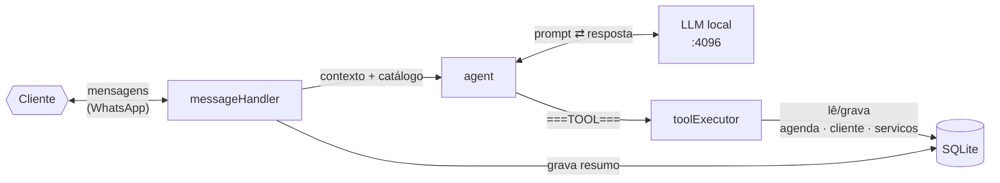
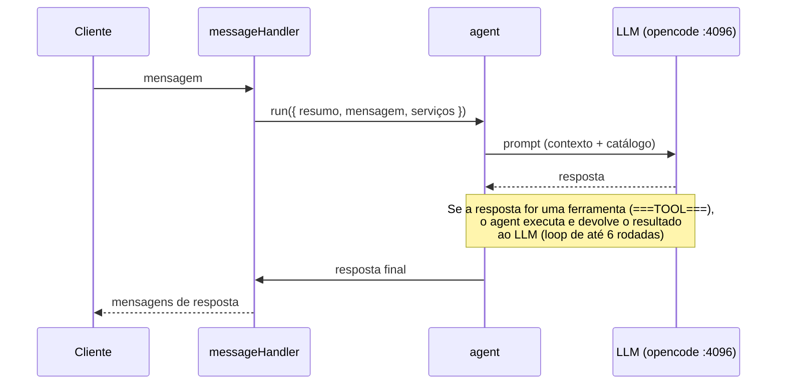

# 🔧 Referência técnica

Arquitetura, banco de dados, configuração e comandos do projeto. Para o início rápido e a visão geral, veja o **[README](../README.md)** — para cada funcionalidade em detalhe, o **[FEATURES.md](FEATURES.md)**.

> Índice de funcionalidades: [FEATURES.md](FEATURES.md) · Guia do operador: [OPERACAO.md](OPERACAO.md) · Ajustes sem código: [AJUSTES.md](AJUSTES.md)

---

## 🏗️ Arquitetura

| Elemento | O que é | Papel no fluxo |
|---|---|---|
| **Cliente** | A pessoa que conversa com o negócio pelo WhatsApp | Envia mensagens e recebe as respostas do bot |
| **messageHandler** (`src/whatsapp/messageHandler.js`) | Orquestrador de cada mensagem | Resolve o telefone, trata mídia/boas-vindas, injeta contexto e envia a resposta final |
| **agent** (`src/llm/agent.js`) | Loop de raciocínio que conversa com o LLM | Monta o prompt e executa ferramentas quando o LLM pede |
| **LLM local** (`opencode serve :4096`) | O "cérebro": modelo de IA rodando no opencode | Gera as respostas do bot |
| **toolExecutor** (`src/services/toolExecutor.js`) | Executor de funções de negócio | Agenda, consulta disponibilidade, salva resumo, notifica emergência, envia imagem |
| **SQLite** (`data/agent.db`) | Banco de dados local | Clientes, agenda e catálogo de serviços |

### Fluxo de cada mensagem

### Por que o protocolo de ferramentas é via texto?

O `opencode serve` expõe a session API (`POST /session/:id/message`), **sem** `tools` nativos. A solução: o prompt instrui o modelo a responder com um envelope JSON marcado (`===TOOL===` / `===END===`); o `agent.js` executa a ferramenta no próprio processo e realimenta a mesma sessão com o resultado. Cada cliente tem **uma sessão** no opencode e **um registro** na tabela `clientes`.

### Nota sobre o transporte do WhatsApp

O envio/recebimento usa a lib **Baileys** diretamente (socket próprio, sessão em `.sessions/`). É funcional e autocontido, mas **não é exatamente o padrão de mercado** — boa parte das integrações brasileiras usa a **Evolution API** (o mesmo Baileys por trás de uma API REST + webhooks).

> [!WARNING]
> **Evolução futura:** a doc pode passar a referenciar a **Evolution API** como camada de WhatsApp — [doc de referência](https://doc.evolution-api.com/). Para rodar/evoluir o projeto, você também pode **pedir auxílio ao próprio opencode** (a IA deste projeto), que conhece o código e as melhores práticas de deploy.

---

## 🗄️ Banco de Dados

SQLite via `better-sqlite3` (zero infra), caminho padrão `./data/agent.db`. Schema em `src/db/schema.js`.

- **`clientes`** — telefone (pk), nome, resumo (memória de longo prazo), timestamps, controle de bloqueio (`chat_fechado`, `motivo_bloqueio`…).
- **`agenda`** — slots com `status`: `livre` → `agendado` → `confirmada`/`cancelada`. Slots livres passados são limpos automaticamente.
- **`servicos`** — catálogo editável (nome, descricao, **categoria**, ativo, ordem). O catálogo é apresentado ao bot **organizado por categoria**. O campo `preco` **não** é lido nem repassado — valores só saem com o responsável. Edite sem SQL pelo painel (`npm run admin`).
- **`avisos_pendentes`** — fila de notificações de processos sem WhatsApp (web/painel) → entregues pelo bot (ver [backpressure](features/backpressure.md)).

---

## 🔧 Configuração (.env)

Veja o [`.env.example`](../.env.example) completo. Principais variáveis:

| Variável | Padrão | Descrição |
|---|---|---|
| `NEGOCIO_NOME` / `NEGOCIO_RESPONSAVEL` | `Assistente Virtual` / `o responsável pelo negócio` | Identidade usada nas apresentações e mensagens do bot |
| `LLM_BACKEND` | `local-opencode` | Backend da IA. |
| `OPENCODE_SERVER_URL` | `http://127.0.0.1:4096` | Onde o `opencode serve` está rodando. |
| `OPENCODE_MODEL` | default da máquina | Ex: `opencode/big-pickle`. |
| `WORK_SCHEDULE` | `1-4:12-21,5:10-19,6:8-14` | Horários de **trabalho/bloqueados**: `dias:inicio-fim`. |
| `SCHEDULE_START` / `SCHEDULE_END` | `7` / `24` | Janela do dia em que slots podem existir. |
| `SLOT_MINUTES` | `60` | Duração de cada slot (1h). |
| `HORIZON_DAYS` | `14` | Dias à frente do auto-seed. |
| `NOTIF_WHATSAPP` | vazio | Número do responsável p/ avisar agendamentos via WhatsApp. |
| `NOTIF_EMAIL` | vazio | Email do responsável p/ avisar agendamentos. |
| `SMTP_HOST`/`SMTP_PORT`/`SMTP_USER`/`SMTP_PASS` | Gmail | SMTP (senha de app). |
| `EMERGENCY_NUMBER` | vazio | Número que recebe alertas de urgência. |
| `IMAGENS_ATIVO` | `false` | Habilita envio de imagens/GIFs ao cliente. |
| `WELCOME_IMAGE` / `WELCOME_TEXT` / `WELCOME_INACTIVE_HORAS` | — | Boas-vindas. |
| `KEEP_MESSAGES` / `SUMMARIZE_EVERY` | `12` / `5` | Histórico volátil e frequência do resumo persistente. |
| `ADMIN_PORT` / `ADMIN_TOKEN` | `3000` / vazio | Porta e token do painel admin (Bearer). |
| `WEB_HOST` / `WEB_PORT` | `127.0.0.1` / `4000` | Onde fica o chat web (página + API). |
| `LLM_MAX_CONCURRENT` / `LLM_TIMEOUT_MS` | `3` / `60000` | Turnos de IA em paralelo e teto por turno. |
| `ENVIO_MIN_GAP_MS` | `700` | Intervalo mínimo entre envios no WhatsApp (ms). |
| `WEB_MAX_CONCURRENT` / `WEB_TIMEOUT_MS` | `3` / `60000` | Teto de respostas simultâneas e timeout no chat web. |

---

## 🧰 Comandos

| Comando | Ação |
|---|---|
| `npm run setup` | Wizard de configuração (identidade, agenda, notificações; instala o opencode) |
| `npm start` | **Sobe tudo** (IA + bot + painel + web) com supervisor e auto-restart |
| `npm run start:bot` | Só o bot (espera o `serve` estar no ar) |
| `npm run serve` | Sobe o opencode server (:4096) — outra janela |
| `npm run dev` | Inicia o bot com watch |
| `npm run admin` | Painel web (dashboard/serviços/agenda/clientes) em http://127.0.0.1:3000 |
| `npm run web` | Chat web em http://127.0.0.1:4000 |
| `npm run seed` | Gera horários livres na agenda (manual — o bot já auto-seeda) |
| `npm run test:llm` | Smoke test da IA local |

---

## 🛠️ Dependências

**5 dependências diretas** (transitivas ficam sob responsabilidade do `npm`):

| Pacote | Para quê | Documentação |
|---|---|---|
| [`@whiskeysockets/baileys`](https://github.com/WhiskeySockets/Baileys) | Conexão com o WhatsApp (socket, sessão) | [GitHub + Wiki](https://github.com/WhiskeySockets/Baileys/wiki) · [Getting Started](https://github.com/WhiskeySockets/Baileys/wiki/Getting-Started) |
| [`better-sqlite3`](https://github.com/WiseLibs/better-sqlite3) | Banco de dados local (SQLite) | [GitHub](https://github.com/WiseLibs/better-sqlite3) · [API completa](https://github.com/WiseLibs/better-sqlite3/blob/master/docs/api.md) |
| [`dotenv`](https://github.com/motdotla/dotenv) | Variáveis de ambiente do `.env` | [GitHub + usage](https://github.com/motdotla/dotenv?tab=readme-ov-file#usage) |
| [`nodemailer`](https://nodemailer.com/) | Emails de notificação ao responsável | [**nodemailer.com**](https://nodemailer.com/) · [API](https://nodemailer.com/message/) |
| [`qrcode-terminal`](https://github.com/gtanner/qrcode-terminal) | QR Code de login no terminal | [GitHub](https://github.com/gtanner/qrcode-terminal) |

**Dependência global (fora do projeto):**

| Pacote | Instalação | Para quê | Documentação |
|---|---|---|---|
| [`opencode`](https://opencode.ai) | `npm install -g opencode-ai` | CLI de IA — roda o servidor local (`:4096`) que é o cérebro do bot | [**opencode.ai/docs**](https://opencode.ai/docs) · [npm](https://www.npmjs.com/package/opencode-ai) |

> Em uma máquina limpa, basta `npm install` (diretas + transitivas) e `npm install -g opencode-ai` (ou deixar o `npm run setup` cuidar). Nenhuma API paga é necessária.

---

## 🔒 Aviso de privacidade

O modelo `big-pickle` é gratuito, mas durante o período free as interações podem ser usadas para melhorar o modelo. Para dados sensíveis de clientes em produção, prefira um modelo pago com **zero-retention** ou um modelo local de verdade (ex: Ollama).